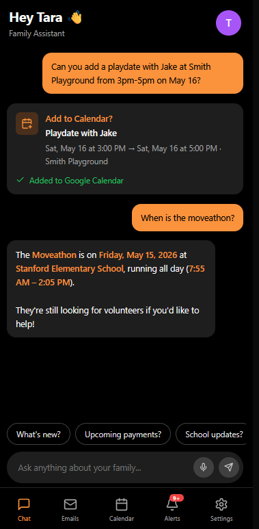
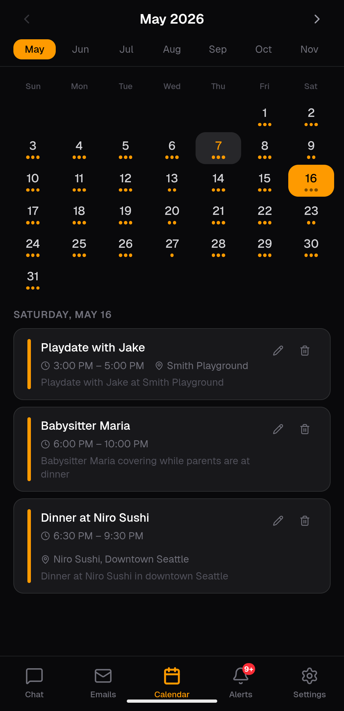
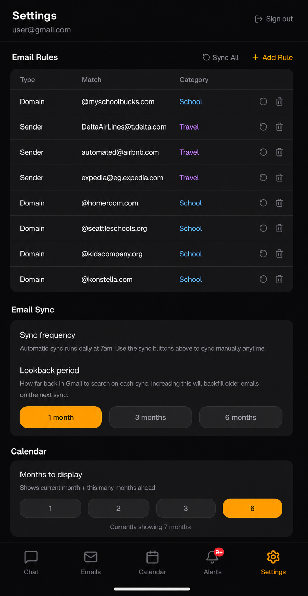
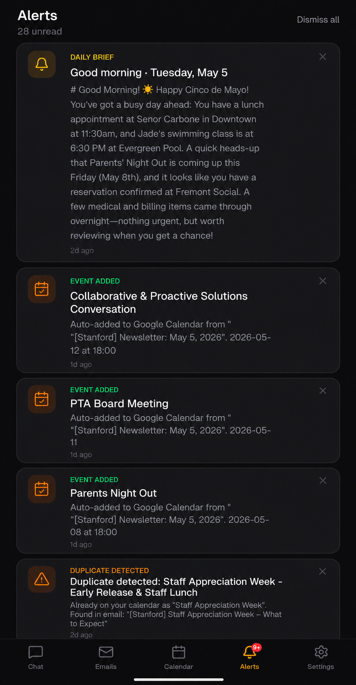

# Family Assistant

### The AI-powered command center for busy parents — one place to search your emails, coordinate your calendar, and stay in sync as a family.


---

## The Problem

There is a chaos that every parent recognises instantly. It doesn't make headlines. It doesn't have a product category. But it consumes real time and causes real stress every single week.

Your child's school sends an email about a field trip — permission slip due Friday. Your spouse gets a separate email about picture day next Thursday. A parent emails about coordinating a playdate this weekend. You get a payment reminder from the pediatrician. A birthday party invitation arrives. A school newsletter mentions the Spring Fair in two weeks. Buried in another thread is the confirmation for the family vacation you booked three months ago, and you can't remember if you ever added it to the calendar. Your own dentist appointment is somewhere in your inbox too — you're pretty sure it's next Tuesday.

None of these are urgent in isolation. Together, they form a constant low-level noise that requires ongoing attention, coordination between two parents, and the kind of working memory that modern life steadily erodes.

**Family communications are fragmented across two inboxes, requiring constant manual effort to track, coordinate, and act on — leading to missed commitments and mental load for both parents.**

Family Assistant solves this by giving both parents a shared AI interface over their combined email and calendar — so the answer to "what's happening this week?" is one question away, not a 20-minute inbox search.

---

## Screenshots

<p align="center">
  
  
  
  
</p>
<p align="center">
  <em>Chat &nbsp;&nbsp;&nbsp;&nbsp;&nbsp;&nbsp;&nbsp;&nbsp;&nbsp;&nbsp;&nbsp;&nbsp;&nbsp; Calendar &nbsp;&nbsp;&nbsp;&nbsp;&nbsp;&nbsp;&nbsp;&nbsp;&nbsp;&nbsp;&nbsp;&nbsp; Settings &nbsp;&nbsp;&nbsp;&nbsp;&nbsp;&nbsp;&nbsp;&nbsp;&nbsp;&nbsp;&nbsp;&nbsp;&nbsp; Alerts</em>
</p>

---

## Key Features

- **AI Chat with Context** — Ask questions in plain English. The assistant searches your synced emails using semantic vector search and your live Google Calendar to answer accurately, not generically.
- **Automatic Calendar Detection** — Newly synced emails are scanned by AI. If an event is detected (a party invite, school field trip, appointment confirmation), it's added to your Google Calendar automatically.
- **Rules-Based Email Sync** — Only emails matching your configured rules (by sender, domain, or keyword) are synced and stored. No AI auto-categorization clutter — you define what matters.
- **Shared Between Both Parents** — Both parents log in with their own Google account and see the same emails, the same chat history, and the same calendar. One source of truth.
- **Daily Briefing** — Every morning, a cron job generates a summary of today's calendar events and emails from the last 24 hours, delivered as an in-app notification.
- **Calendar Management from Chat** — Tell the assistant to "add swim practice every Tuesday at 4pm" and it creates the event, shows a confirmation card, and handles recurring rules via RRULE. US public holidays are included automatically.
- **Duplicate Detection** — Before creating a calendar event, the app checks Google Calendar and uses Claude Haiku for fuzzy matching to prevent duplicates, with an override option if needed.
- **Voice Input** — Tap the microphone in chat and speak your question. The Web Speech API transcribes and sends automatically.
- **Your Data Stays Yours** — Runs on your own Supabase database, your own Google OAuth credentials, and your own Vercel deployment. Nothing is shared with third-party servers beyond the AI APIs you configure.

---

## Tech Stack

| Layer | Technology |
|---|---|
| Framework | Next.js 16 (App Router, TypeScript) |
| UI | Tailwind CSS 4, shadcn/ui, Radix UI primitives |
| Auth | NextAuth.js v5 (Google OAuth 2.0) |
| Database | Supabase (PostgreSQL + pgvector) |
| AI — Chat | Anthropic Claude (`claude-sonnet-4-6`) |
| AI — Detection | Anthropic Claude Haiku (lightweight, fast) |
| Embeddings | OpenAI `text-embedding-3-small` (1536-dim vectors) |
| Email | Gmail API (OAuth, server-side sync) |
| Calendar | Google Calendar API (live reads + writes) |
| Hosting | Vercel (serverless, daily cron support) |
| Security | AES-256-GCM encryption for stored OAuth tokens |

---

## Architecture

```
┌─────────────────────────────────────────────────────────────┐
│                        Browser / PWA                        │
│   Chat · Emails · Calendar · Notifications · Settings       │
└────────────────────┬────────────────────────────────────────┘
                     │ HTTPS
┌────────────────────▼────────────────────────────────────────┐
│                    Next.js on Vercel                         │
│                                                             │
│  /api/chat          →  RAG pipeline (pgvector + calendar)   │
│  /api/emails/sync   →  Gmail API → rules → embed → store    │
│  /api/calendar      →  Google Calendar API (CRUD)           │
│  /api/notifications →  In-app notification feed             │
│  /api/cron/sync-emails  →  Daily 7am UTC cron               │
└──────┬──────────────┬──────────────┬────────────────────────┘
       │              │              │
┌──────▼──────┐ ┌─────▼──────┐ ┌────▼────────────┐
│  Supabase   │ │  Anthropic │ │  Google APIs    │
│             │ │            │ │                 │
│  emails     │ │  Claude    │ │  Gmail          │
│  embeddings │ │  Sonnet    │ │  Calendar       │
│  chat_hist  │ │  Haiku     │ │  OAuth 2.0      │
│  rules      │ └────────────┘ └─────────────────┘
│  settings   │
│  notifs     │ ┌────────────┐
│  pgvector   │ │  OpenAI    │
└─────────────┘ │  Embeddings│
                └────────────┘
```

### How a Chat Message Works

1. User types "What school events are coming up?"
2. The message is embedded with OpenAI `text-embedding-3-small`
3. pgvector finds the 8 most semantically relevant emails
4. Live Google Calendar events for the next 3 months are fetched
5. All context is assembled into a prompt and sent to Claude
6. Claude responds, and if it detects a calendar action, it calls the `suggest_calendar_event` tool
7. The UI shows an inline confirm card before any event is created

### How Email Sync Works

1. Vercel cron fires at 7am UTC (or manually triggered from Settings)
2. For each configured rule, a targeted Gmail `q` query fetches only matching messages
3. Each email is cleaned (HTML stripped, attachments extracted — PDF, CSV, HTML, plain text)
4. Emails are passed to Claude Haiku to detect if they contain a calendar-worthy event
5. The email body + attachment text is embedded and stored in Supabase with pgvector
6. A daily brief notification is generated summarizing today's calendar and recent emails

---

## Setup

### Prerequisites

- Node.js 18+
- A [Supabase](https://supabase.com) project
- A [Google Cloud](https://console.cloud.google.com) project with Gmail API and Google Calendar API enabled
- An [Anthropic](https://console.anthropic.com) API key
- An [OpenAI](https://platform.openai.com) API key
- A [Vercel](https://vercel.com) account (for deployment and cron jobs)

### 1. Clone and Install

```bash
git clone https://github.com/kunalmaliks/family-assistant.git
cd family-assistant
npm install
```

### 2. Configure Google OAuth

1. Go to [Google Cloud Console](https://console.cloud.google.com) → APIs & Services → Credentials
2. Create an OAuth 2.0 Client ID (Web application)
3. Add authorized redirect URIs:
   - `http://localhost:3000/api/auth/callback/google` (development)
   - `https://your-app.vercel.app/api/auth/callback/google` (production)
4. Enable the **Gmail API** and **Google Calendar API** for your project
5. Copy the Client ID and Client Secret

### 3. Set Up Supabase

1. Create a new Supabase project
2. Enable the `pgvector` extension: Supabase dashboard → Database → Extensions → search "vector" → enable
3. Open `supabase/schema.sql`, copy the full contents, and paste it into the Supabase SQL editor (Dashboard → SQL Editor → New query). Run it to create all tables (`users`, `emails`, `attachments`, `chat_history`, `category_rules`, `settings`, `notifications`) and the pgvector `match_emails()` similarity function.

### 4. Environment Variables

Copy `.env.local.example` to `.env.local` and fill in all values:

```env
# ── Authentication ──────────────────────────────────────────
# Generate with: openssl rand -base64 32
AUTH_SECRET=

# ── Google OAuth ─────────────────────────────────────────────
GOOGLE_CLIENT_ID=
GOOGLE_CLIENT_SECRET=

# ── Supabase ──────────────────────────────────────────────────
# Found in: Supabase dashboard → Settings → API
NEXT_PUBLIC_SUPABASE_URL=https://your-project.supabase.co  # Browser client
SUPABASE_URL=https://your-project.supabase.co              # Server client (same value)
NEXT_PUBLIC_SUPABASE_ANON_KEY=sb_publishable_...   # Safe for browser
SUPABASE_SERVICE_ROLE_KEY=sb_secret_...            # Server only — bypasses RLS

# ── AI APIs ───────────────────────────────────────────────────
ANTHROPIC_API_KEY=
OPENAI_API_KEY=

# ── Cron Security ────────────────────────────────────────────
# Generate with: openssl rand -base64 32
# Must match the secret you set in Vercel dashboard
CRON_SECRET=
```

> **Important:** `SUPABASE_SERVICE_ROLE_KEY` must be the secret key (prefix `sb_secret_...`), not the anon/publishable key. Using the wrong key will cause all server-side database reads to fail silently.

### 5. Run Locally

```bash
npm run dev
```

Open [http://localhost:3000](http://localhost:3000). Sign in with a Google account that has Gmail and Calendar access.

### 6. Deploy to Vercel

```bash
npm install -g vercel
vercel
```

Add all environment variables in the Vercel dashboard under Project → Settings → Environment Variables. The `vercel.json` already configures the daily cron job:

```json
{
  "crons": [
    {
      "path": "/api/cron/sync-emails",
      "schedule": "0 7 * * *"
    }
  ]
}
```

Set `CRON_SECRET` in Vercel to the same value as in your `.env.local`. Vercel passes this automatically in the `Authorization` header when triggering the cron route.

---

## Environment Variables Reference

| Variable | Required | Description |
|---|---|---|
| `AUTH_SECRET` | Yes | NextAuth.js secret — generate with `openssl rand -base64 32` |
| `GOOGLE_CLIENT_ID` | Yes | Google OAuth 2.0 client ID |
| `GOOGLE_CLIENT_SECRET` | Yes | Google OAuth 2.0 client secret |
| `NEXT_PUBLIC_SUPABASE_URL` | Yes | Supabase project URL (browser client) |
| `SUPABASE_URL` | Yes | Supabase project URL (server client — same value as above) |
| `NEXT_PUBLIC_SUPABASE_ANON_KEY` | Yes | Supabase publishable key (safe for browser, subject to RLS) |
| `SUPABASE_SERVICE_ROLE_KEY` | Yes | Supabase secret key (server-only, bypasses RLS) |
| `ANTHROPIC_API_KEY` | Yes | Anthropic API key for Claude (chat + event detection) |
| `OPENAI_API_KEY` | Yes | OpenAI API key for `text-embedding-3-small` |
| `CRON_SECRET` | Yes | Secret to authenticate Vercel cron requests |

---

## Usage

### Adding Email Rules

Go to **Settings → Add Rule**. Rules can match by:
- **Sender** — exact email address (e.g. `teacher@school.org`)
- **Domain** — all emails from a domain (e.g. `@school.org`)
- **Keyword** — subject/body keyword (e.g. `field trip`)

Assign a category: School, Payments, Travel, Activities, or Other. Only emails matching at least one rule are synced and stored.

### Chatting with the Assistant

Open the **Chat** tab. Ask anything:
- "What's happening this week?"
- "Do I have any upcoming payments?"
- "Add swim practice every Tuesday at 4pm"
- "What did the school send last week about the field trip?"

The assistant searches your synced emails and live calendar to answer. Calendar suggestions appear as confirm cards — tap to add, or dismiss.

### Manual Sync

Go to **Settings**. Each rule has a sync button to fetch only emails matching that rule. **Sync All** runs all rules concurrently. The `gmail_id` unique constraint prevents duplicates even if syncs overlap.

---

## Project Structure

```
family-assistant/
├── app/
│   ├── api/
│   │   ├── chat/              # AI chat endpoint (RAG pipeline)
│   │   ├── calendar/          # Google Calendar CRUD
│   │   ├── emails/            # Email list + sync + categorize
│   │   ├── notifications/     # In-app notification feed
│   │   ├── settings/          # Rules, sync frequency, lookback
│   │   └── cron/              # Vercel cron — daily sync + brief
│   ├── (app)/
│   │   ├── chat/              # Chat UI
│   │   ├── emails/            # Email list with rule filter pills
│   │   ├── calendar/          # Monthly calendar grid
│   │   ├── notifications/     # Notification feed
│   │   └── settings/          # Settings + add-rule form
│   └── login/                 # Google sign-in page
├── components/                # Shared React components
├── lib/
│   ├── gmail.ts               # Gmail API integration
│   ├── calendar.ts            # Google Calendar API integration
│   ├── supabase.ts            # Supabase client (server + browser)
│   ├── detect-calendar-events.ts  # Claude Haiku event detection
│   ├── generate-daily-brief.ts    # Daily briefing generation
│   ├── duplicate-check.ts         # Calendar duplicate detection
│   ├── token-crypto.ts            # AES-256-GCM token encryption
│   └── get-or-create-user.ts      # Defensive user upsert
├── supabase/
│   └── schema.sql             # Full database schema + pgvector setup
├── auth.ts                    # NextAuth v5 config + token refresh
├── vercel.json                # Cron job schedule
└── CLAUDE.md                  # AI coding assistant instructions
```

---

## Database Schema

```sql
users           — Google OAuth tokens (AES-256-GCM encrypted), profile
emails          — Synced Gmail messages, category, embedding vector (1536-dim)
attachments     — Extracted text from PDF/CSV/HTML attachments
chat_history    — Shared conversation history for both parents
category_rules  — User-defined sync rules (sender / domain / keyword)
settings        — Sync frequency, lookback period, timezone per user
notifications   — Daily briefs, auto-event alerts, duplicate warnings
```

Vector similarity search is powered by pgvector's `match_emails()` function, which finds the 8 most semantically relevant emails for any given query using cosine distance.

---

## Design Decisions

**Rules-only sync, not AI categorization.** Every email that enters the system was explicitly invited by a rule you wrote. This keeps the dataset clean and predictable — the AI assistant only sees emails that are actually relevant to your family.

**Live calendar reads, not stored events.** Calendar events are fetched directly from the Google Calendar API on every request. Deleting an event in Google Calendar removes it from the app instantly, with no sync lag.

**Shared data model.** Both parents see identical emails, chat history, and calendar data. There is no per-user filtering beyond authentication. This is intentional — coordination requires a shared ground truth.

**Token encryption.** Google OAuth access and refresh tokens are encrypted with AES-256-GCM before being stored in Supabase, so a database breach does not expose live API credentials.

**Concurrent sync safety.** Multiple sync operations can run in parallel. Deduplication is handled by a unique constraint on `gmail_id` — the database rejects duplicates at the insertion layer, not in application code.

---

## License

MIT
